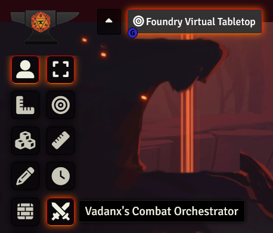

# Vadanx's Combat Orchestrator

Vadanx's Combat Orchestrator is a Foundry VTT module for orchestrating smoother combat encounters.

It is as easy as selecting your tokens and hitting the combat orchestration control button.

1. Playlists switched for combat.
2. Tokens toggled for the encounter.
3. UI updated prioritizing chat and combat.
4. Initiatives called for all tokens.
5. Combat starts when initiatives are rolled.
6. Playlists and UI reverted when combat finishes.
